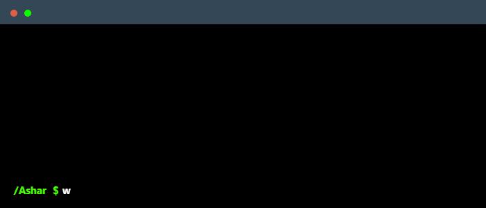

  

<h1 align="center">Hi there! 👋 I'm Muhammad (Ashar) Mian</h1>

  

---

## 🚀 About Me

I'm Muhammad (Ashar) Mian, a passionate Computer Science student at **Mississippi State University** (Class of 2027), honored with a **full-tuition scholarship** and maintaining a **4.00 GPA**. I'm driven by curiosity and a love for building impactful technology—especially in **robotics, automation, AR/VR, and AI**.

---

## 💻 Skills

### Languages

### Tools & Frameworks

### Interests
🤖 Robotics | ⚙️ Automation | 🥽 AR/VR Development | 📊 Data Handling & Visualization | 🧠 Machine Learning | 🤖 AI | 🚗 Vehicles

---

## 📫 Connect with Me

📧 **Email:** asharmian2004@gmail.com  
📱 **Phone:** 662-497-8806

---

## 🌱 Fun Facts

- When I'm not coding, you'll find me playing **table tennis** or building something new! 🏓
- I believe in continuous learning and pushing the boundaries of what's possible with technology 🚀

---

  

  

  

---

  <i>⭐️ From <a href="https://github.com/Muhammadasharmian">Muhammadasharmian</a></i>

